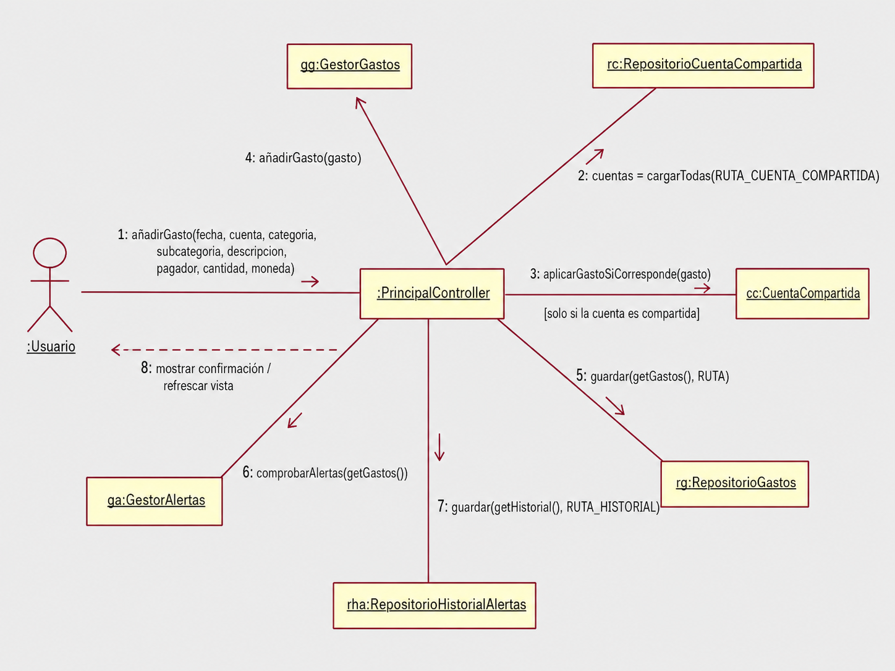

# Diagrama de interacción

Este documento muestra un diagrama de interacción de la aplicación **Gestión de Gastos**.

El caso representado es el proceso de **registrar un gasto desde la ventana principal**.  
Se ha elegido este caso porque es una de las funcionalidades centrales de la aplicación y conecta varias partes importantes del sistema: interfaz gráfica, gestor de gastos, cuentas compartidas, persistencia y alertas.

---

## 1. Caso de uso representado

El diagrama representa el siguiente caso:

**Registrar un gasto manualmente desde la interfaz gráfica.**

El usuario introduce los datos del gasto en la ventana principal y pulsa el botón para añadirlo.  
A partir de ese momento, el controlador principal coordina las operaciones necesarias para guardar el gasto, actualizar saldos si pertenece a una cuenta compartida, comprobar alertas y refrescar la vista.

---

## 2. Diagrama de interacción



---

## 3. Objetos que participan

En el diagrama aparecen los siguientes objetos:

- `:Usuario`: actor que introduce los datos del gasto.
- `:PrincipalController`: controlador de la ventana principal.
- `gg:GestorGastos`: gestor encargado de mantener los gastos en memoria.
- `rc:RepositorioCuentaCompartida`: repositorio que carga las cuentas compartidas.
- `cc:CuentaCompartida`: cuenta compartida donde puede aplicarse el gasto.
- `rg:RepositorioGastos`: repositorio que guarda los gastos en JSON.
- `ga:GestorAlertas`: gestor encargado de comprobar si se supera alguna alerta.
- `rha:RepositorioHistorialAlertas`: repositorio que guarda el historial de notificaciones.

---

## 4. Secuencia de mensajes

### 1. El usuario solicita añadir un gasto

El usuario introduce los datos del gasto en la interfaz gráfica y ejecuta la acción:

```text
añadirGasto(fecha, cuenta, categoria, subcategoria, descripcion, pagador, cantidad, moneda)
```

Esta acción llega al objeto `PrincipalController`, que es el controlador encargado de gestionar la ventana principal.

---

### 2. Se cargan las cuentas compartidas

El controlador consulta el repositorio de cuentas compartidas:

```text
cuentas = cargarTodas(RUTA_CUENTA_COMPARTIDA)
```

Esto permite saber si la cuenta indicada por el usuario es una cuenta personal o una cuenta compartida.

---

### 3. Se aplica el gasto a la cuenta compartida

Si el gasto pertenece a una cuenta compartida, el controlador llama a:

```text
aplicarGastoSiCorresponde(gasto)
```

Este paso solo se ejecuta cuando la cuenta del gasto coincide con una cuenta compartida existente.

En ese caso, la cuenta compartida actualiza los saldos de las personas.  
Si no hay porcentajes configurados, el reparto es equitativo.  
Si hay porcentajes configurados, se aplica el reparto personalizado.

---

### 4. Se añade el gasto al gestor

Después, el controlador añade el gasto al gestor principal:

```text
añadirGasto(gasto)
```

El objeto `GestorGastos` mantiene la lista de gastos en memoria durante la ejecución de la aplicación.

---

### 5. Se guarda el gasto en JSON

Una vez añadido el gasto, el controlador guarda la lista actualizada mediante el repositorio:

```text
guardar(getGastos(), RUTA)
```

El objeto `RepositorioGastos` se encarga de escribir los datos en el fichero `gastos.json`.

---

### 6. Se comprueban las alertas

Después de guardar el gasto, se comprueban las alertas activas:

```text
comprobarAlertas(getGastos())
```

El objeto `GestorAlertas` revisa las alertas semanales y mensuales configuradas por el usuario.

Si alguna alerta se cumple, se genera una nueva notificación.

---

### 7. Se guarda el historial de alertas

Si el historial de alertas cambia, se guarda en JSON:

```text
guardar(getHistorial(), RUTA_HISTORIAL)
```

El objeto `RepositorioHistorialAlertas` se encarga de persistir las notificaciones en `historial_alertas.json`.

---

### 8. Se actualiza la vista

Finalmente, la interfaz muestra el resultado al usuario:

```text
mostrar confirmación / refrescar vista
```

La tabla de gastos se actualiza y el usuario puede ver el nuevo gasto registrado.

---

## 5. Explicación del diseño

Este diagrama muestra que el `PrincipalController` actúa como coordinador del caso de uso.

El controlador no realiza directamente todas las operaciones, sino que delega en otras clases:

- Delega la gestión de gastos en `GestorGastos`.
- Delega la persistencia en `RepositorioGastos`.
- Delega la gestión de cuentas compartidas en `CuentaCompartida`.
- Delega la comprobación de alertas en `GestorAlertas`.
- Delega el guardado del historial en `RepositorioHistorialAlertas`.


