# Manual de usuario

Este documento explica cómo utilizar la aplicación **Gestión de Gastos**.

La aplicación permite gestionar gastos personales mediante una interfaz gráfica desarrollada con JavaFX. También incluye importación y exportación de ficheros, estadísticas, alertas, cuentas compartidas y una línea de comandos básica.

---

## 1. Inicio de la aplicación

Para iniciar la aplicación desde Maven se puede usar el siguiente comando:

```bash
mvn javafx:run
```

Al iniciar la aplicación se abre la ventana principal de **Gestión de Gastos**.


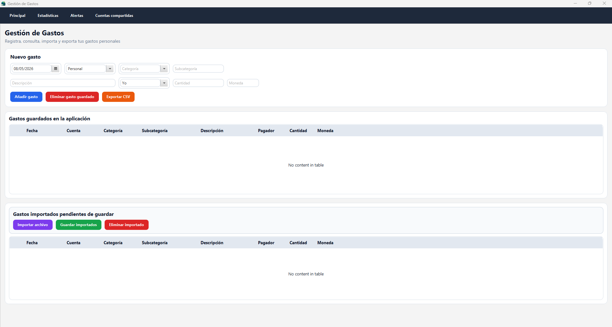


---

## 2. Navegación principal

La aplicación tiene una zona superior de navegación con varios apartados:

- **Principal**
- **Estadísticas**
- **Alertas**
- **Cuentas compartidas**

Cada botón cambia el contenido central de la aplicación sin abrir una nueva ventana.


---

## 3. Registrar un gasto manualmente

Para añadir un gasto manual desde la ventana principal, el usuario debe rellenar los campos del formulario.

Los campos principales son:

- Fecha.
- Cuenta.
- Categoría.
- Subcategoría.
- Descripción.
- Pagador.
- Cantidad.
- Moneda.

Después debe pulsar el botón **Añadir gasto**.

Si los datos son correctos, el gasto aparece en la tabla de gastos guardados.


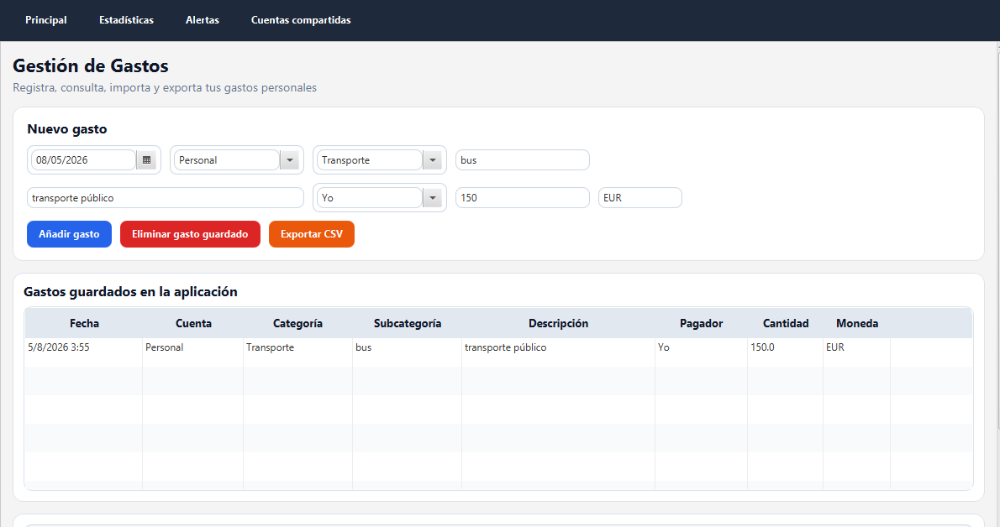


---

## 4. Ver gastos guardados

Los gastos registrados aparecen en la tabla **Gastos guardados en la aplicación**.

La tabla muestra:

- Fecha.
- Cuenta.
- Categoría.
- Subcategoría.
- Descripción.
- Pagador.
- Cantidad.
- Moneda.

Los gastos se ordenan de más reciente a más antiguo.


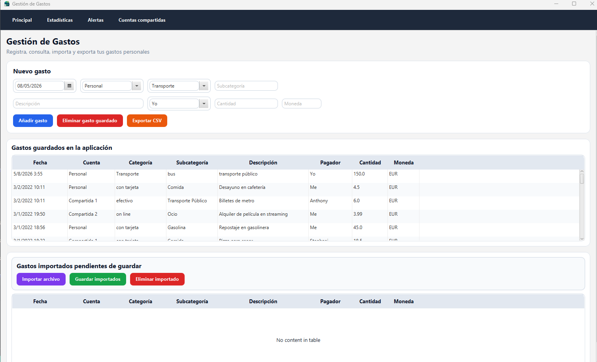


---

## 5. Editar gastos guardados

La aplicación permite modificar algunos campos directamente desde la tabla.

Para editar un campo:

1. Hacer doble clic sobre la celda.
2. Cambiar el valor.
3. Pulsar Enter para confirmar.

Los cambios se guardan automáticamente en el fichero JSON.

En el caso de gastos asociados a cuentas compartidas, algunos campos están protegidos para evitar inconsistencias en los saldos.

No se permite modificar directamente:

- Cuenta.
- Pagador.
- Cantidad.


---

## 6. Eliminar un gasto guardado

Para eliminar un gasto:

1. Seleccionar una fila en la tabla de gastos guardados.
2. Pulsar el botón **Eliminar gasto guardado**.

El gasto desaparece de la tabla y también se elimina del fichero JSON.

Si el gasto pertenecía a una cuenta compartida, la aplicación recalcula los saldos de las cuentas compartidas.


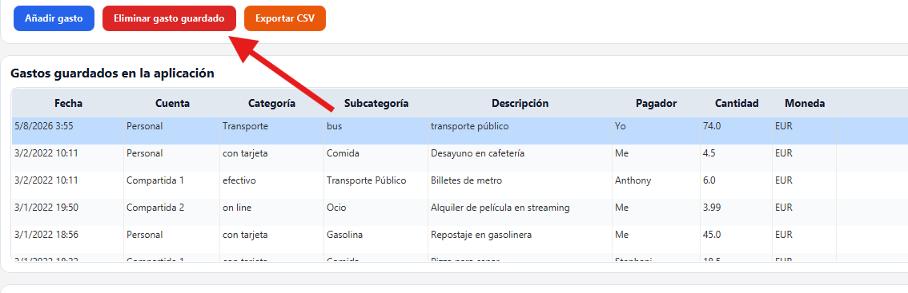


---

## 7. Importar gastos desde CSV o TXT

La aplicación permite importar gastos desde ficheros externos.

Para importar:

1. Pulsar **Importar archivo**.
2. Seleccionar un fichero `.csv` o `.txt`.
3. Revisar los gastos importados en la tabla inferior.

Los gastos importados no se guardan directamente. Primero aparecen en la tabla **Gastos importados pendientes de guardar**.

Esto permite revisar los datos antes de incorporarlos definitivamente.


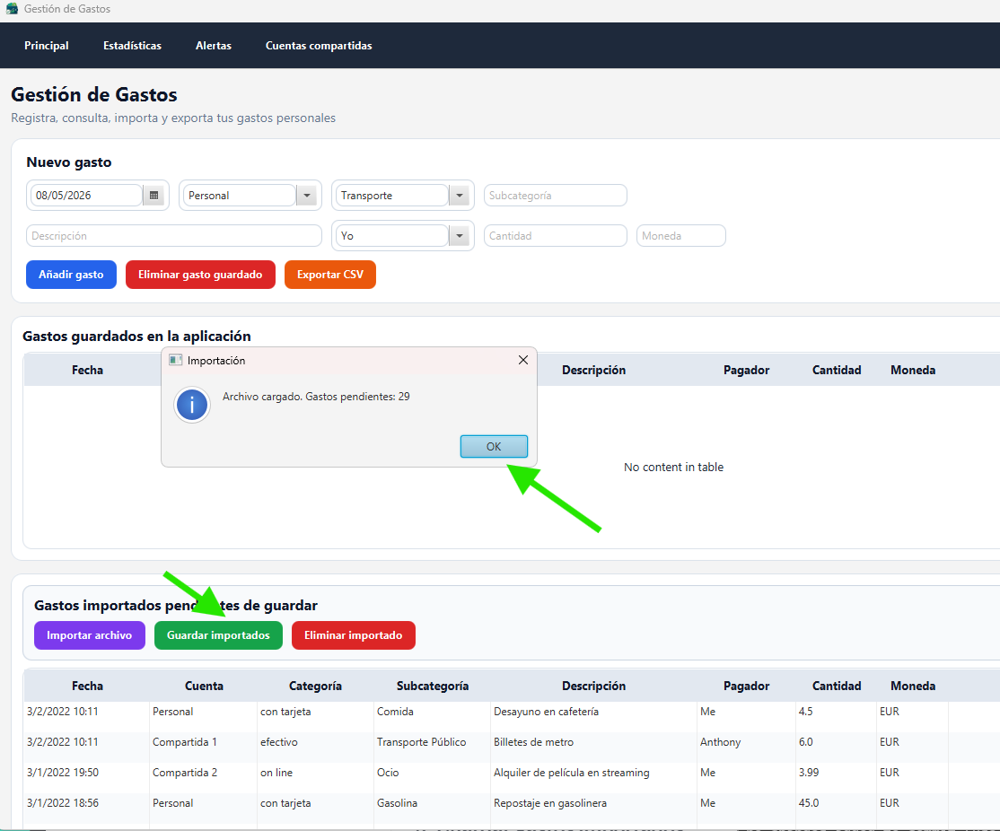


---

## 8. Guardar gastos importados

Después de importar un fichero, los gastos aparecen como pendientes.

Para guardarlos definitivamente:

1. Revisar la tabla de gastos importados.
2. Pulsar **Guardar importados**.

Los gastos pasan a la tabla principal y se guardan en `gastos.json`.

Si algún gasto importado pertenece a una cuenta compartida, también se actualizan sus saldos.


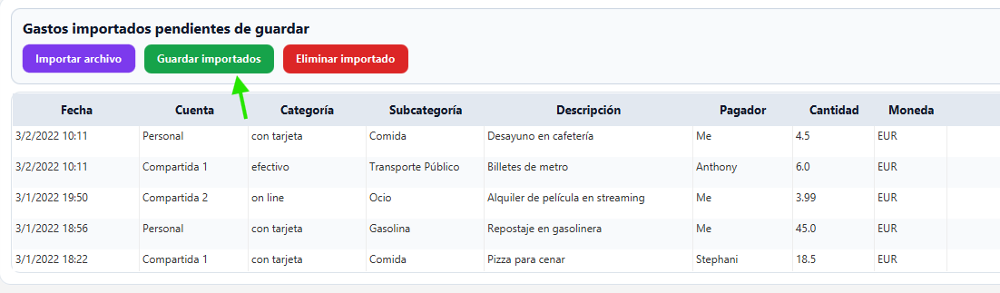

---

## 9. Eliminar un gasto importado pendiente

Si un gasto importado no debe guardarse, se puede eliminar antes de incorporarlo a la aplicación.

Para ello:

1. Seleccionar el gasto en la tabla de importados.
2. Pulsar **Eliminar importado**.

El gasto desaparece solo de la tabla de importados pendientes.

---

## 10. Exportar gastos a CSV

La aplicación permite exportar los gastos guardados a un fichero CSV.

Para exportar:

1. Pulsar **Exportar CSV**.
2. Elegir la ubicación donde se quiere guardar el fichero.
3. Escribir el nombre del archivo.
4. Confirmar.

El fichero generado contiene una cabecera con los campos:

```text
Date,Account,Category,Subcategory,Note,Payer,Amount,Currency
```

**Captura recomendada:** ventana de guardado o mensaje de exportación correcta.


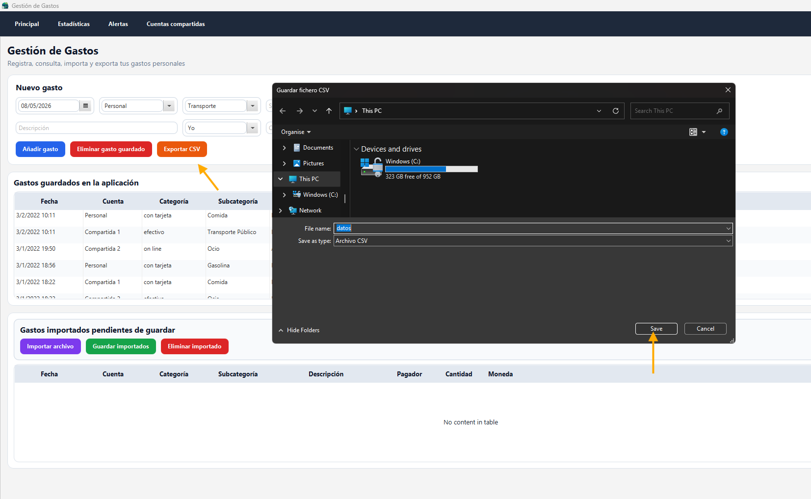

---

## 11. Consultar estadísticas

Desde la sección **Estadísticas**, el usuario puede consultar información resumida de sus gastos.

La pantalla muestra:

- Total gastado.
- Número de gastos.
- Gasto medio.
- Gráfico circular por categorías.
- Gráfico de barras por categorías.
- Tabla resumen por categoría.


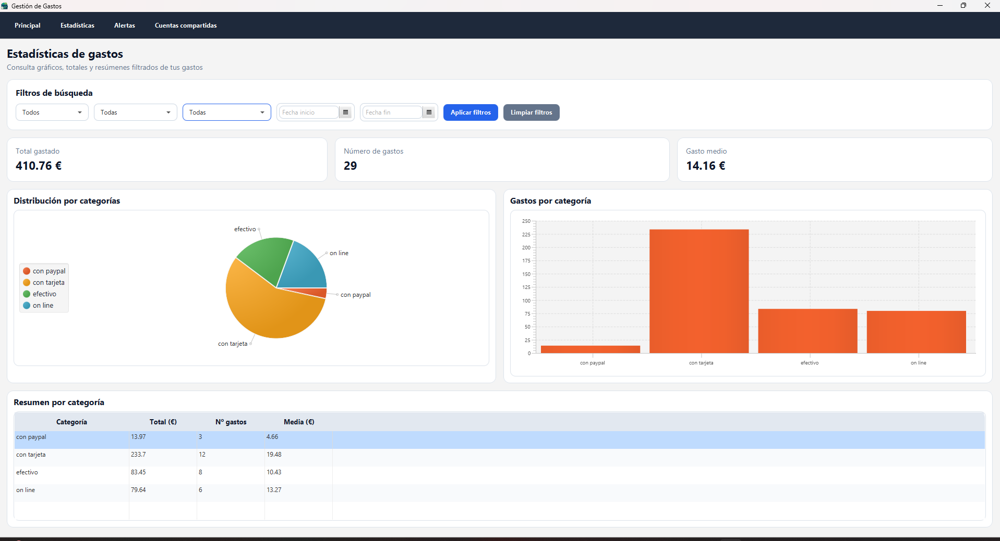


---

## 12. Aplicar filtros en estadísticas

En la sección de estadísticas se pueden aplicar filtros por:

- Mes.
- Cuenta.
- Categoría.
- Fecha inicio.
- Fecha fin.

Para aplicar filtros:

1. Seleccionar los valores deseados.
2. Pulsar **Aplicar filtros**.

Para volver a mostrar todos los datos:

1. Pulsar **Limpiar filtros**.

Los filtros afectan a los gráficos, al total, al número de gastos, a la media y a la tabla resumen.


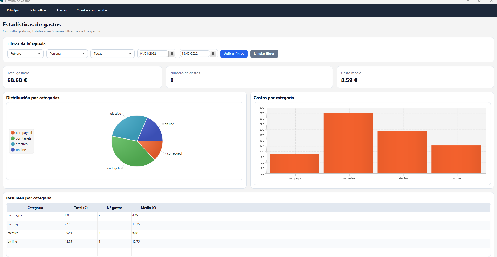


---

## 13. Crear una alerta

Desde la sección **Alertas**, el usuario puede crear alertas de gasto.

Para crear una alerta:

1. Elegir el tipo de alerta:
   - Mensual.
   - Semanal.
2. Introducir un límite económico.
3. Elegir una categoría si se quiere limitar la alerta a una categoría concreta.
4. Pulsar **Crear alerta**.

La categoría es opcional. Si no se indica categoría, la alerta se aplica a todos los gastos.


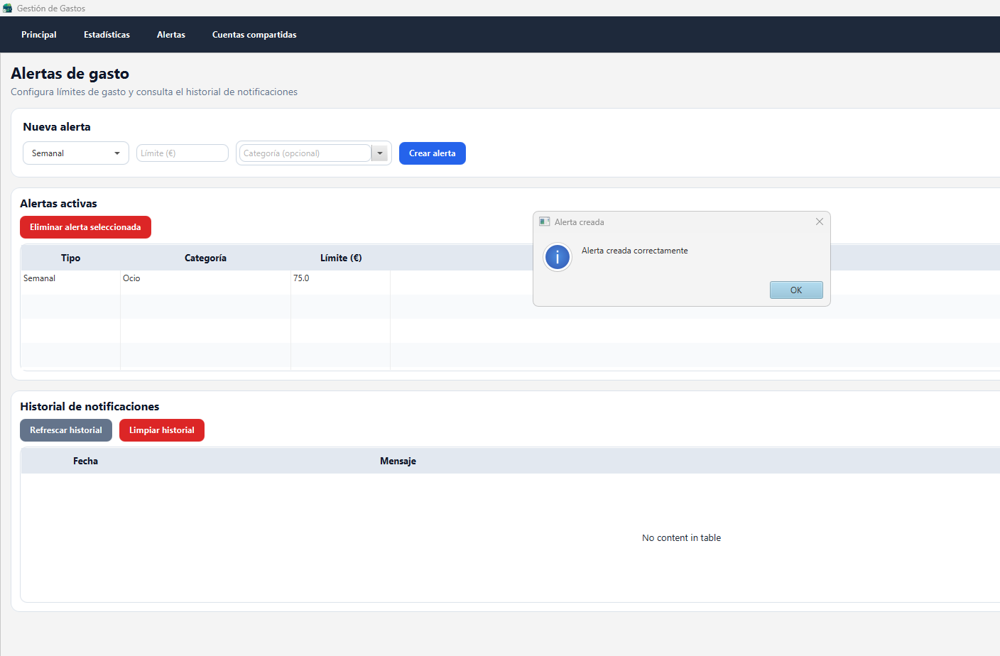


---

## 14. Consultar alertas activas

Las alertas creadas aparecen en la tabla **Alertas activas**.

Cada alerta muestra:

- Tipo.
- Categoría.
- Límite.

Si la categoría aparece como **Todas**, significa que la alerta se aplica a todos los gastos.


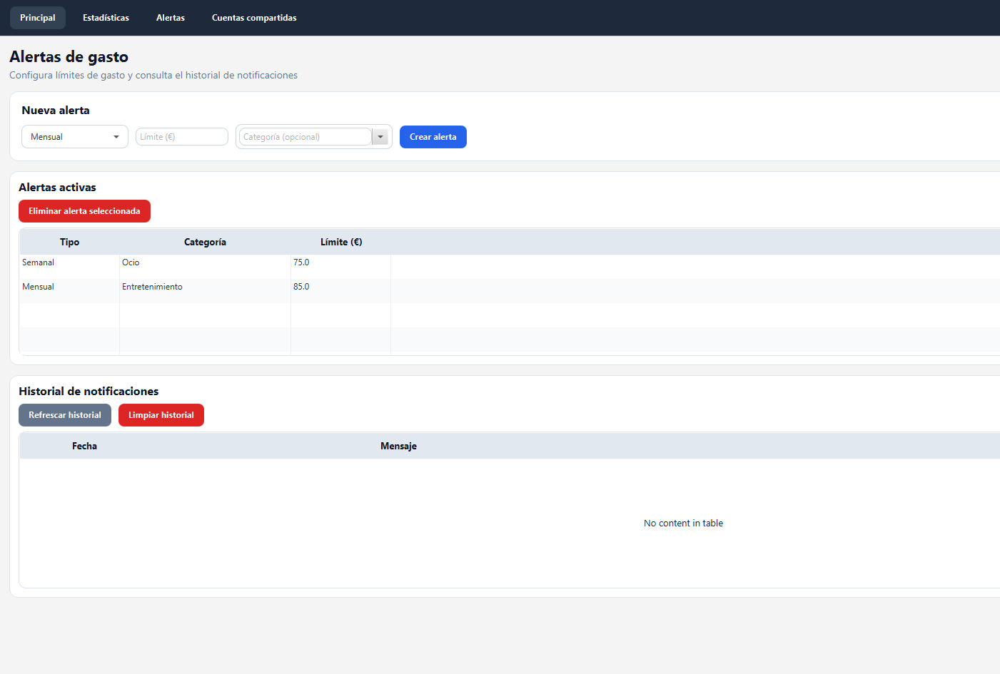


---

## 15. Eliminar una alerta

Para eliminar una alerta:

1. Seleccionar una alerta en la tabla.
2. Pulsar **Eliminar alerta seleccionada**.

La alerta se elimina de la aplicación y también del fichero JSON de alertas.

---

## 16. Consultar historial de notificaciones

La sección de alertas también incluye una tabla de historial.

El historial muestra las notificaciones generadas cuando se supera una alerta.

Cada notificación contiene:

- Fecha.
- Mensaje.

El usuario puede usar:

- **Refrescar historial**, para recargar las notificaciones.
- **Limpiar historial**, para borrar el historial.


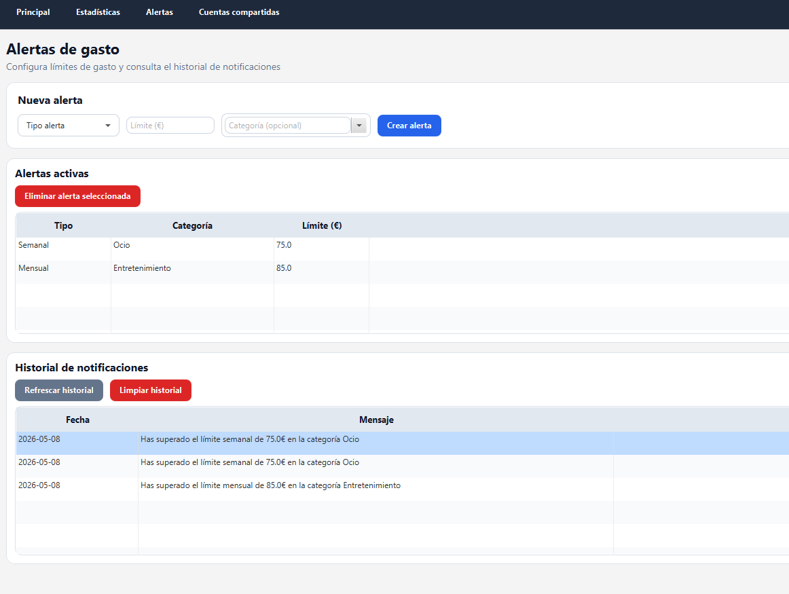


---

## 17. Crear una cuenta compartida

Desde la sección **Cuentas compartidas**, el usuario puede crear cuentas para repartir gastos entre varias personas.

Para crear una cuenta:

1. Escribir el nombre de la cuenta.
2. Añadir al menos dos personas.
3. Pulsar **Crear cuenta**.

No se pueden crear dos cuentas con el mismo nombre.

Una vez creada la cuenta, la lista de personas no puede modificarse para evitar inconsistencias en los saldos.


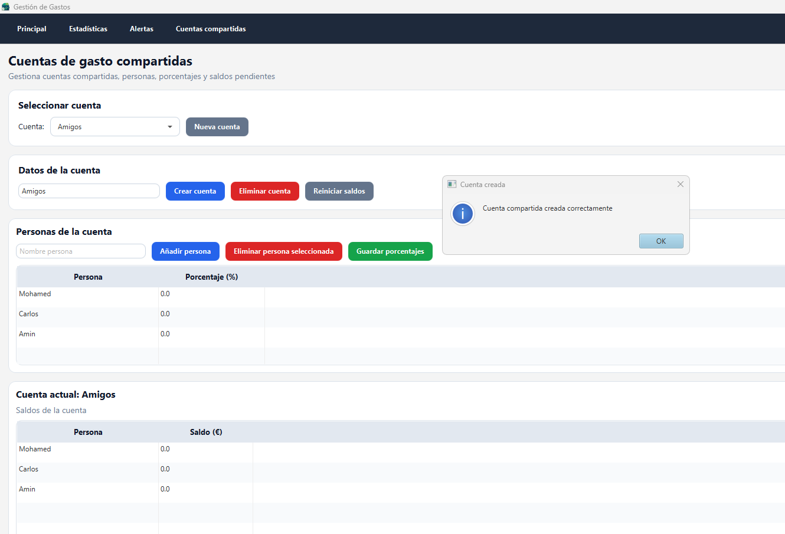


---

## 18. Configurar porcentajes de reparto

Una cuenta compartida puede usar reparto equitativo o reparto por porcentajes.

Por defecto, si no se configuran porcentajes, el gasto se reparte de forma equitativa.

Para configurar porcentajes:

1. Seleccionar una cuenta compartida.
2. Editar el porcentaje de cada persona en la tabla.
3. Pulsar **Guardar porcentajes**.

La suma total de porcentajes debe ser 100%.

Si no suma 100%, la aplicación muestra un error.


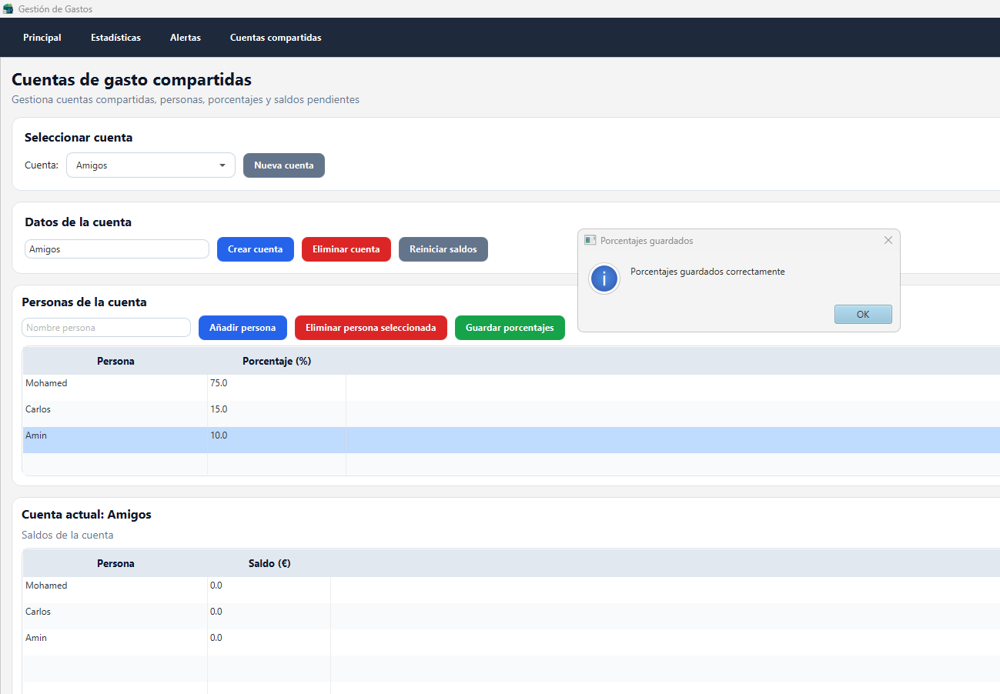


---

## 19. Consultar saldos de una cuenta compartida

La tabla de saldos muestra cuánto debe o cuánto le deben a cada persona.

- Un saldo positivo indica que a esa persona le deben dinero.
- Un saldo negativo indica que esa persona debe dinero.

Los saldos se actualizan cuando se añaden o eliminan gastos asociados a esa cuenta compartida.


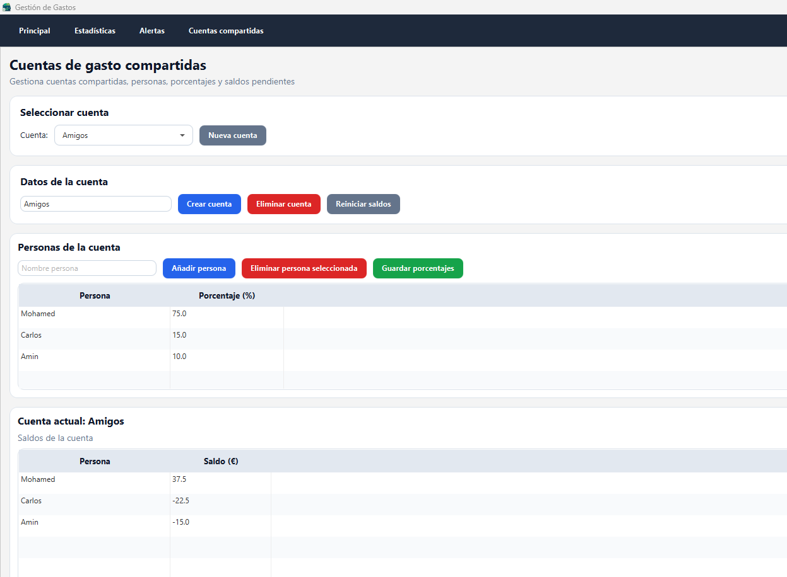


---

## 20. Reiniciar saldos

El usuario puede reiniciar los saldos de una cuenta compartida pulsando **Reiniciar saldos**.

Antes de hacerlo, la aplicación muestra una confirmación.

Esta opción pone todos los saldos a 0.

---

## 21. Eliminar una cuenta compartida

Para eliminar una cuenta compartida:

1. Seleccionar la cuenta.
2. Pulsar **Eliminar cuenta**.
3. Confirmar la operación.

La aplicación no permite eliminar una cuenta compartida si todavía existen gastos asociados a ella.

Esto evita que queden gastos guardados apuntando a una cuenta que ya no existe.

---

## 22. Uso de la línea de comandos

Además de la interfaz gráfica, la aplicación tiene una línea de comandos mediante la clase `CLI`.

Para ejecutarla se puede usar:

```bash
mvn exec:java "-Dexec.mainClass=umu.tds.GestionGastos.CLI"
```

La línea de comandos permite:

- Listar gastos.
- Añadir gastos.
- Modificar gastos.
- Borrar gastos.

Los cambios realizados desde la línea de comandos se guardan en los mismos ficheros JSON que usa la interfaz gráfica.


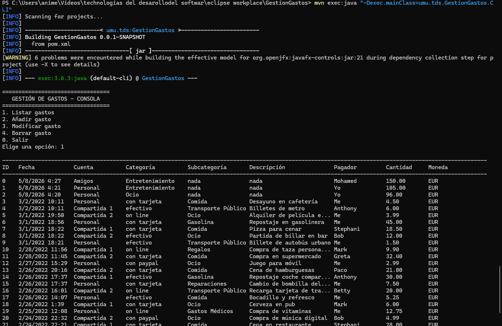


---

## 23. Ficheros generados por la aplicación

La aplicación genera varios ficheros JSON en la carpeta del proyecto:

```text
gastos.json
alertas.json
historial_alertas.json
cuentas_compartidas.json
```

Estos ficheros almacenan la información persistente de la aplicación.

También puede generar ficheros CSV cuando el usuario exporta gastos.

---


## 24. Conclusión

Este manual resume el uso principal de la aplicación **Gestión de Gastos**.

El usuario puede registrar gastos, importarlos, exportarlos, consultar estadísticas, configurar alertas, gestionar cuentas compartidas y utilizar una línea de comandos básica.

La aplicación mantiene los datos guardados mediante ficheros JSON, por lo que la información se conserva entre ejecuciones.
